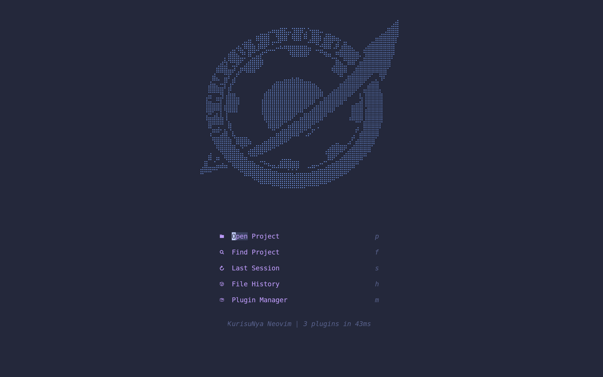
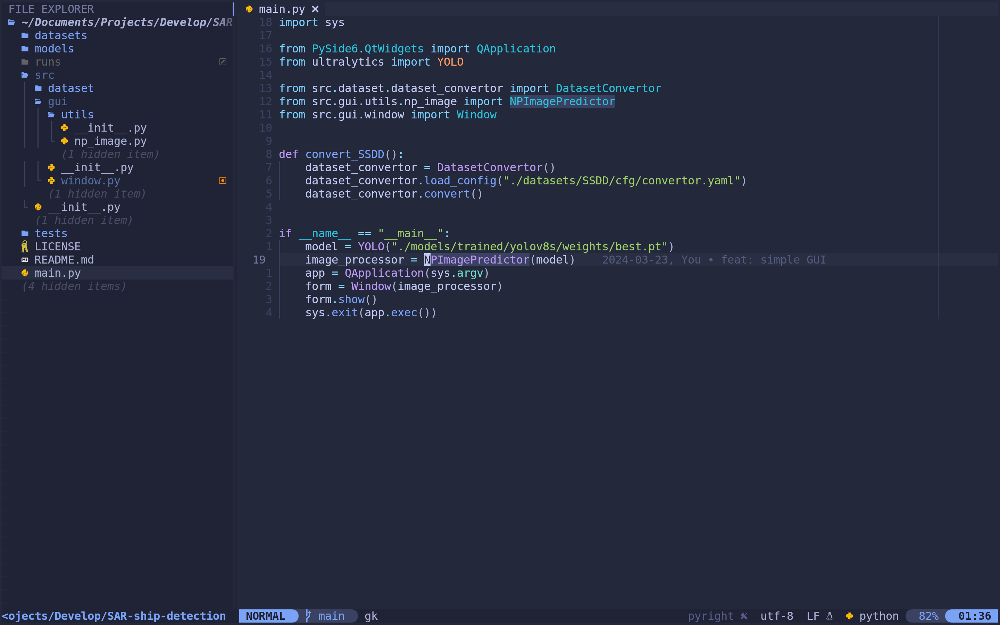
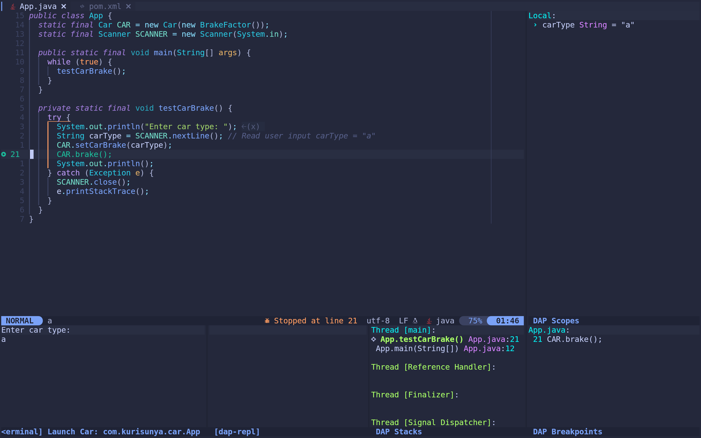

# nvim-config

Full lua nvim config using lazy.nvim as plugin manager.

To make nvim start faster, most of plugins has been loaded lazily.

Welcome to fork!!! 😊

## Screenshots

### Dashboard

### Coding

## Debugging

## Tips

* Remember to run `:checkhealth` and fix the errors.

* If you are Windows user, make sure `im-select` is available in your environment path.

There is the link of [im-select](https://github.com/daipeihust/im-select).
