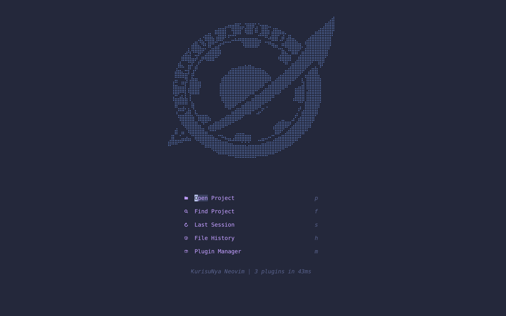
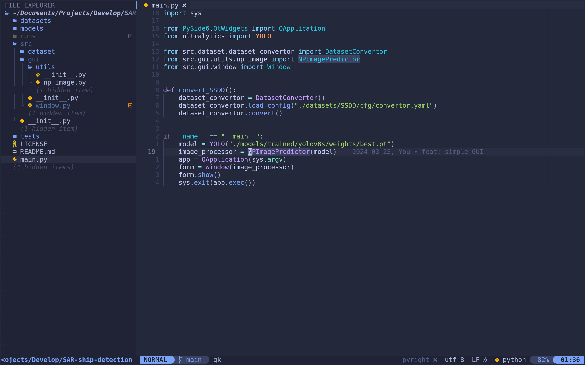
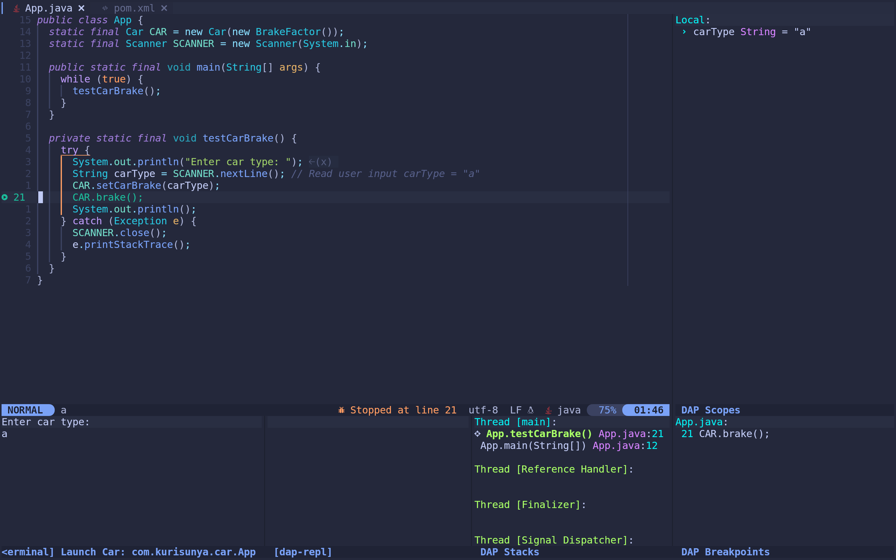

# nvim-config

Full lua nvim config using lazy.nvim as plugin manager.

To make nvim start faster, most of plugins has been loaded lazily.

Welcome to fork!!! 😊

## Setup

1. install neovim and npm(mason plugin depends on it)
2. clone this repo to `~/.config/nvim`(Linux) or `$HOME\AppData\nvim`(Windows)
3. install the plugins by entering `nvim`(lazy.nvim will install the plugins automatically)
4. check the `:checkhealth` to make sure everything is ok(except Sniprun)
5. edit the `~/.config/nvim/init.lua` to make it suit your needs

### Tips

* If you are Windows user, make sure `im-select` is available in your environment path. There is the link of [im-select](https://github.com/daipeihust/im-select).

## Overall Mapping

`<space>` is the leader key, `q` for quit, `H` for hover, `J` and `K` to move 5 lines.

the macro key is remapped to `<leader>M`

## Screenshots

### Dashboard

### Coding

### Debugging

